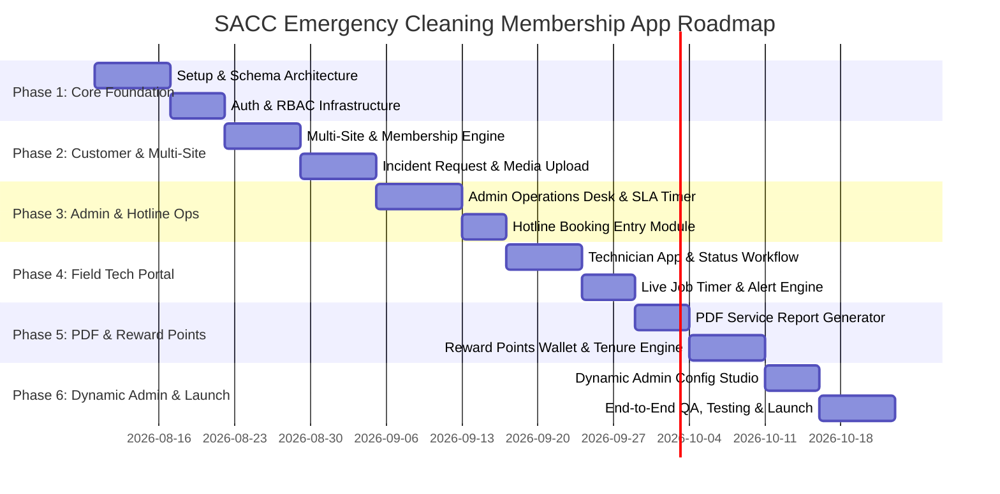

# SA Emergency Cleaning App
## Master Development Plan & Execution Roadmap

> [!NOTE]
> This document outlines the phased development roadmap, sprint schedule, Work Breakdown Structure (WBS), risk management plan, and quality assurance framework for the SA Emergency Cleaning App.

---

## 1. Phased Development Roadmap

---

## 2. Sprint Schedule & Deliverables

### Phase 1: Core Architecture & Authentication (Sprint 1)
- **Deliverables**:
  - Next.js application workspace initialization with TypeScript & Tailwind CSS.
  - PostgreSQL database deployment & Prisma ORM schemas (`organizations`, `locations`, `users`, `membership_plans`).
  - Auth system setup supporting 3 roles: **Customer Admin**, **Field Technician**, and **System Admin**.
  - Dynamic Glassmorphic Design Token System and Core UI Layout shell.

### Phase 2: Customer Multi-Site Portal & Emergency Incident Engine (Sprint 2 & 3)
- **Deliverables**:
  - Customer Registration flow capturing ABN, Business Name, Site Access Rules, and Emergency Contacts.
  - Multi-Site Management Hub (add/edit sites with location-specific contacts & access codes).
  - Emergency Assistance Request Form with category selector (Spill, Vomit, Water Leak, Toilet Overflow disclaimer display, etc.).
  - Incident Media Uploader (multi-photo and video upload to Azure Blob Storage).
  - Customer Request Confirmation screen with generated unique Job Number (`SACC-YYYY-XXXX`).

### Phase 3: Admin Operations Command Center & SLA Engine (Sprint 4)
- **Deliverables**:
  - Real-time Admin Operations Desk showing live incident submissions, map/list views, and SLA timers.
  - Review Modal (Accept, Decline with Reason, Request More Info, Convert to Quote, Excluded Service).
  - SLA Clock Engine (2–4hr response calculation + SLA clock pause on `MORE_INFO_REQUIRED`).
  - Hotline Booking Module allowing phone operators to manually enter customer requests & attach emailed media.
  - Technician Dispatcher Module (assign available tech to accepted requests).

### Phase 4: Technician Field App & Live Job Timer Engine (Sprint 5)
- **Deliverables**:
  - Dedicated Technician Mobile UI (Assigned jobs queue, turn-by-turn navigation link, site hazard warnings).
  - Technician Live Status Switcher (`TRAVELLING` $\rightarrow$ `ARRIVED` $\rightarrow$ `UNABLE_TO_ACCESS` / `IN_PROGRESS`).
  - Unable-to-Access logger (recording notes, photos, waiting time, and call-out deduction decision).
  - Real-Time 1-Hour Labour Timer Engine with 45m, 55m, and 60m broadcast alerts.
  - Extension Request flow (Customer digital rate display and signature approval).

### Phase 5: PDF Service Report Engine & Reward Points Loyalty Wallet (Sprint 6 & 7)
- **Deliverables**:
  - Automated PDF Service Report Generator compiling timeline, before/after photo evidence, chemical checklist, and digital signatures.
  - PDF storage & instant email dispatch to customer on job completion.
  - Reward Points Wallet Ledger ($1 Membership Fee = 1 Point).
  - Tenure Enforcer (locking redemptions until 6 consecutive active membership months).
  - Point Redemption Catalog & Customer Request Form (Carpet steam cleaning, tile & grout, window panels, etc.).
  - Admin Redemption Approval Queue (points deducted only upon admin approval).

### Phase 6: Dynamic Admin Configuration Studio & Launch Preparation (Sprint 8 & 9)
- **Deliverables**:
  - Zero-code Admin Dynamic Configuration Studio (edit plan prices, included call-outs, hourly rates, additional call-out base fee, incident lists, toilet overflow disclaimer text, and redemption rate catalog).
  - Cross-device QA, end-to-end testing, security penetration audit, and performance optimization.
  - Production deployment & user documentation handoff.

---

## 3. Work Breakdown Structure (WBS) & Task Matrix

| Task ID | Task Description | Role / Owner | Est. Effort | Priority | Dependencies |
| :--- | :--- | :---: | :---: | :---: | :---: |
| **P1-01** | Setup Next.js 14 App Router workspace & design tokens | Frontend Lead | 2 days | High | None |
| **P1-02** | Configure PostgreSQL, Prisma schema & migrations | Backend Lead | 3 days | High | P1-01 |
| **P1-03** | Implement Auth & RBAC Middleware | Fullstack | 3 days | High | P1-02 |
| **P2-01** | Build Customer Registration & Multi-Site Hierarchy UI | Frontend | 4 days | High | P1-03 |
| **P2-02** | Build Emergency Request Form & Toilet Disclaimer | Frontend | 4 days | High | P2-01 |
| **P2-03** | Build Incident Media Upload Pipeline (Azure Blob) | Fullstack | 3 days | High | P2-02 |
| **P3-01** | Build Admin Operations Desk & SLA Timer Logic | Fullstack | 5 days | High | P2-03 |
| **P3-02** | Build Request Review & Tech Dispatcher Modal | Fullstack | 4 days | High | P3-01 |
| **P3-03** | Build Hotline Booking Entry Screen | Fullstack | 3 days | Medium | P3-02 |
| **P4-01** | Build Technician Simplified Mobile UI & Navigation | Frontend | 4 days | High | P3-02 |
| **P4-02** | Build Status Engine (Travelling, Arrived, Access Fail) | Fullstack | 3 days | High | P4-01 |
| **P4-03** | Build 1-Hour Timer & 45/55/60m Alert Cron Jobs | Backend | 4 days | High | P4-02 |
| **P4-04** | Build Overage Extension Request & Sign-off UI | Fullstack | 3 days | High | P4-03 |
| **P5-01** | Build PDF Service Report Generator Pipeline | Backend | 4 days | High | P4-04 |
| **P5-02** | Build Reward Points Ledger & Tenure Checker | Backend | 3 days | High | P1-02 |
| **P5-03** | Build Customer Points Wallet & Redemption Request UI | Frontend | 4 days | High | P5-02 |
| **P5-04** | Build Admin Points Redemption Approval Desk | Fullstack | 3 days | High | P5-03 |
| **P6-01** | Build Dynamic Admin Config Studio (Rates/Plans/Disclaimers)| Fullstack | 5 days | High | P1-02 |
| **P6-02** | Perform End-to-End System Testing & User Acceptance | QA Team | 5 days | High | All |

---

## 4. Risk Assessment & Mitigation Matrix

| Risk | Impact | Likelihood | Mitigation Strategy |
| :--- | :---: | :---: | :--- |
| **Technician Site Access Failure** | High | Medium | Built explicit `Unable to Access Site` status workflow requiring photo proof, notes, and waiting time log, letting Admin decide call-out deduction. |
| **Labor Overage Disputes** | High | Low | Automated 45m/55m/60m warning alerts + mandatory digital customer approval of hourly overage rates before extra work begins. |
| **Slow SLA Clock during Info Gaps** | Medium | Medium | Automated SLA pause functionality when request moves to `MORE_INFO_REQUIRED`, resuming only when customer submits missing data. |
| **Premature Points Redemptions** | Medium | Low | Strict database tenure check enforcing $\ge 6$ consecutive active membership months before unlocking redemption requests, plus manual Admin approval step. |
| **Dynamic Configuration Breaks Code** | High | Low | Dynamic config values validated against strict Zod schema before database write in Admin Studio. |

---

## 5. Verification & Testing Matrix

- **Unit Testing**: Jest / Vitest for business logic (call-out allowance calculations, points math, tenure eligibility checks, SLA pause math).
- **API Integration Testing**: Supertest endpoints for status transitions, dynamic config edits, and media uploads.
- **End-to-End Testing**: Playwright testing full user flows (Customer request submission $\rightarrow$ Admin Review $\rightarrow$ Tech Arrival/Timer $\rightarrow$ Job Completion PDF generation).
- **Device & Cross-Browser Verification**: Verified on iOS Safari, Android Chrome, and Desktop Chrome/Edge/Firefox.

---

## 6. Multi-Step Registration & Company Account Management Scenarios

### 6.1 Multi-Step Company Registration Wizard
- **Step 1: Company Details & Location Selection**: Captures Business Name, ABN, Primary Contact, Phone, Email, and Address. **Strictly restricted exclusively to Adelaide, South Australia locations** (Adelaide CBD 5000, North Adelaide 5006, Port Adelaide 5015, Norwood 5067, Unley 5061, Glenelg 5045, Mawson Lakes 5095, Marion 5043, Salisbury 5108, Elizabeth 5112, etc. / Postcodes 5000–5199).
- **Step 2: Terms & Conditions Agreement**: Interactive T&C display requiring explicit checkbox agreement (6-month tenure requirement, 2-4 hr SLA, 1 hr labor included, toilet overflow non-plumbing disclaimer).
- **Step 3: Package Selection**: Selection of membership tier (Essential $99/mo - 1 callout, Business $199/mo - 2 callouts, Premium $399/mo - 4 callouts).
- **Step 4: Payment Selection**: Multi-option payment setup featuring **Direct Debit (PayTo Bank Direct)** and **Credit Card (Visa / MasterCard)**.
- **Step 5 (System Admin Mode Only)**: Set initial login credentials (password) for the company account.

### 6.2 System Admin Company Registration & Credential Issuance
- System Admin has a dedicated **"REGISTER COMPANY (SYSTEM ADMIN)"** button in the Admin Operations Hub.
- System Admin can perform the complete registration process on behalf of any company and issue official access credentials.

### 6.3 Company Main Account Dashboard & Profile Security
- **Metrics Display**: Prominent display of Remaining Callouts, Available Points, and Active Membership Plan.
- **Profile & Password Update**: Self-service modal allowing companies to update contact info and change their password.
- **Subscription Cancellation**: Self-service modal allowing companies to cancel membership, freezing benefits and updating status to `CANCELLED`.

