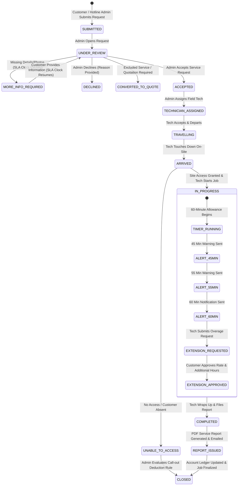

# SA Emergency Cleaning App
## Project Map & System Architecture Blueprint

> [!NOTE]
> This document maps out the system architecture, user roles, core workflows, modular breakdown, and state machines for the **SA Emergency Cleaning** App.

---

## 1. System Architecture Map

```mermaid
graph TD
    subgraph Client Applications
        C_APP["Customer Portal / Mobile Web<br/>(Multi-Site Business User)"]
        A_APP["Admin Operations Hub<br/>(Dispatch & Operations)"]
        T_APP["Technician Field App<br/>(Simplified Field UI)"]
    end

    subgraph API & Gateway Layer
        GW["API Gateway / App Router"]
        AUTH["Auth & Role-Based Access Control (RBAC)"]
        REALTIME["Real-Time Engine (WebSockets / Azure SignalR)"]
    end

    subgraph Core Application Services
        SUB_SVC["Membership & PayTo Billing Service"]
        INC_SVC["Incident & Request Management Service"]
        DISP_SVC["Dispatch & SLA Tracking Service"]
        TIMER_SVC["Job Timer & Alert Engine (45/55/60m)"]
        PTS_SVC["Reward Points & Tenure Verification Ledger"]
        PDF_SVC["Service Report PDF Generation Engine"]
        CFG_SVC["Dynamic Admin Rules & Rates Config Studio"]
    end

    subgraph Data & Storage Layer (Microsoft Azure Australia East)
        DB[("Azure Database for PostgreSQL<br/>Multi-Site, Subscriptions, Jobs, Points")]
        CACHE[("Azure Cache for Redis<br/>Active Timers & Realtime State")]
        STORAGE[("Azure Blob Storage<br/>Photos, Videos, PDF Reports")]
    end

    C_APP --> GW
    A_APP --> GW
    T_APP --> GW

    GW --> AUTH
    GW --> REALTIME

    GW --> SUB_SVC
    GW --> INC_SVC
    GW --> DISP_SVC
    GW --> TIMER_SVC
    GW --> PTS_SVC
    GW --> PDF_SVC
    GW --> CFG_SVC

    SUB_SVC --> DB
    INC_SVC --> DB
    INC_SVC --> STORAGE
    DISP_SVC --> DB
    DISP_SVC --> REALTIME
    TIMER_SVC --> CACHE
    TIMER_SVC --> REALTIME
    PTS_SVC --> DB
    PDF_SVC --> STORAGE
    CFG_SVC --> DB
```

---

## 2. User Roles & Capability Matrix

| Feature / Domain | Customer (Business Admin) | Field Technician | Admin / Dispatcher |
| :--- | :---: | :---: | :---: |
| Account & Multi-Site Registration | Full Access | No Access | Full Management |
| Membership Plan Subscription | View & Change | No Access | Override / Admin Edit |
| Request Emergency Cleaning | Create & Track | View Assigned | Create Manual (Hotline) & Manage |
| Incident Media Upload | Photos & Videos | Before/After Photos | View & Manage Media |
| Live Response SLA Timer | View Target Time | View Target Time | View & Pause SLA |
| Technician Status Update | View Live Status | Full Control (Travelling → Done) | Reassign & Override |
| Job Timer & Extension Approval | Approve Extra Hours | Start/Stop & Request Extra | Monitor & Alert Dispatch |
| Service Report & PDF Download | View & Download | Complete & Collect Signatures | Generate & Edit |
| Reward Points Wallet & Tenure | View & Request Redeem | No Access | Manage Balance & Approve |
| System Rates & Allowances Config | Read Only (Public Rates) | No Access | **100% Dynamic Control** |

---

## 3. Comprehensive Request Workflow & State Machine



---

## 4. Modular System Components

### Component A: Multi-Site Customer Account Hub
- **Business Account Root**: Tracks Business Name, ABN, Primary Contact, Phone, Email, Billing History.
- **Location Hierarchy**: Main account holds 1-to-N locations.
  - Each site tracks: Site Name, Address, Site Contact Name/Phone, Access/Keycard Instructions, Security/Parking Rules, Site Hazards, Historical Jobs.

### Component B: Membership & Dynamic Rates Engine
- **Plans Supported**:
  - **Essential** ($99/mo) – 1 Included Call-Out / month (Up to 1 hr labour).
  - **Business** ($199/mo) – 2 Included Call-Outs / month (Up to 1 hr labour).
  - **Premium** ($399/mo) – 4 Included Call-Outs / month (Up to 1 hr labour).
- **Admin Configuration Studio**: Zero-code dashboard to update plan prices, call-out allowances, hourly labour overage rates, additional call-out base fee ($30 default), and incident categories without code redeployment.

### Component C: Emergency Incident Reporting Engine
- **Request Form Fields**: Selected Location, Incident Category, Description, Affected Area Size ($m^2$), Time of Incident, Ongoing Status Flag, Safety/Access Confirmation, Onsite Contact, Access/Parking Notes.
- **Incident Category Logic**:
  - Standard categories: Spill, Vomit, Urine/Faeces, Carpet Stain, Water Leak, Wet Carpet, Toilet Overflow, Broken Glass, Oil/Grease, Bin Leakage, Emergency Bathroom, Emergency Kitchen, Minor Graffiti, Other.
  - **Special Disclaimer Enforcer**: Toilet overflow requests render an explicit disclaimer (*"Cleaning of affected area and surrounding surfaces only. SA Commercial Cleaning does not provide plumbing..."*).
  - Excluded/Specialist Flagging for automatic quote routing.
- **Media Vault**: Upload multiple photos & short video clips.

### Component D: Admin SLA Dispatch & Operations Center
- **Response SLA Clock**: Automatically calculates 2–4 hour target arrival time from timestamp of valid request submission.
- **Pause SLA Controller**: Pauses response timer when request state moves to `MORE_INFO_REQUIRED`.
- **Hotline Booking Entry**: Allows phone support admins to manually create requests on behalf of callers and attach emailed photos.

### Component E: Technician Field Interface
- Role-restricted mobile UI featuring active dispatch queue, turn-by-turn navigation link, site access details, safety warnings, and live state triggers (`TRAVELLING`, `ARRIVED`, `UNABLE_TO_ACCESS`, `START_JOB`, `EXTENSION`, `COMPLETE_JOB`).

### Component F: Live Job Timer & Overage Protection Engine
- Active timer with automated broadcast notifications at **45 minutes**, **55 minutes**, and **60 minutes**.
- **Extension Workflow**: Technician requests extra time → System displays additional hourly rate → Customer grants digital approval → Chargeable work proceeds.

### Component G: Service Report & PDF Engine
- Collects arrival/start/completion timestamps, description of work, chemical/equipment inventory, recommendations, before/after photos, tech notes, and digital customer signature.
- Compiles standard PDF Service Report automatically saved to customer account dashboard.

### Component H: Reward Points Loyalty Wallet & Redemption Studio
- **Accrual Logic**: $1 Membership Fee Paid = 1 Emergency Reward Point.
- **Tenure Verification Rule**: Customer must maintain an active membership for at least **6 consecutive months** before points redemption is unlocked.
- **Dynamic Redemption Catalog**: Points per $m^2$, per panel, or per hour (e.g., Carpet Steam 5 pts/$m^2$, Tile & Grout 7 pts/$m^2$, Internal Windows 8 pts/panel, Deep Cleaning 100 pts/hr).
- **Approval Queue**: Admin manually approves redemption requests before points are deducted from wallet.

---

## 5. Information Architecture & Navigation Structure

```
SACC App Suite
├── Customer Web & Mobile Portal
│   ├── Login / Register / Multi-Site Setup
│   ├── Dashboard (Membership Status, Call-outs Left, Points Balance, Emergency Button)
│   ├── Request Emergency Assistance Form
│   ├── Live Request Tracker & Status Timeline
│   ├── Active Job Extension Approval Screen
│   ├── Job History & PDF Service Reports
│   ├── Reward Points Wallet & Redemption Request Form
│   └── Invoices & Account Settings
│
├── Technician Mobile Web App
│   ├── Active Assigned Jobs Dashboard
│   ├── Job Detail View (Site Address, Access Code, Incident Media, SLA Clock)
│   ├── Live Status Switcher (Travelling -> Arrived -> In Progress)
│   ├── Real-Time Job Timer & Overage Request Form
│   └── Digital Completion Form (Before/After Photos, Work Log, Signature)
│
└── Admin Operations & Management Dashboard
    ├── Incident Command Desk (Live Jobs Map/List, SLA Clocks, Hotline Creation)
    ├── Job Dispatch & Technician Allocation
    ├── Customer & Multi-Site Directory (With Company Registration & Credential Generation)
    ├── Reward Points Redemption Approval Queue
    └── Dynamic Configuration Studio
        ├── Membership Plans & Rates Editor
        ├── Call-out Allowances & Overage Pricing
        ├── Points Redemption Rate Matrix
        └── Incident Categories & Policy Disclaimers

---

## 6. Registration & Company Account Management Architecture

### 6.1 Multi-Step Registration Subsystem
- **Wizard Flow**: Step 1 (Company Details & Adelaide Location restriction) $\rightarrow$ Step 2 (Terms & Conditions check) $\rightarrow$ Step 3 (Membership Package selection) $\rightarrow$ Step 4 (Payment method selection: Direct Debit vs Credit Card) $\rightarrow$ Step 5 (If System Admin: Create Credentials).
- **Adelaide Location Enforcement**: Restricts locations exclusively to Adelaide, South Australia (Adelaide CBD 5000, North Adelaide 5006, Port Adelaide 5015, Norwood 5067, Unley 5061, Glenelg 5045, Mawson Lakes 5095, Marion 5043, Salisbury 5108, Elizabeth 5112, etc. / Postcodes 5000–5199). Rejects non-Adelaide entries.

### 6.2 System Admin Company Creation & Credential Manager
- System Admin can trigger company registration directly from `AdminOperationsHub`.
- Creates company records and assigns initial login credentials (email & password).

### 6.3 Customer Main Account & Profile Control
- **Main Account Portal**: Displays callouts remaining, available points, membership status (`ACTIVE` vs `CANCELLED`), and payment method.
- **Profile & Security Modal**: Allows updating contact details and changing passwords.
- **Subscription Cancellation Modal**: Allows self-service membership cancellation with benefit freeze and status update.

```
