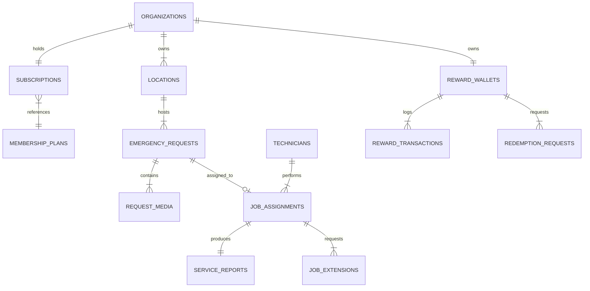

# SA Emergency Cleaning App
## Project Technology Specification Document (Microsoft Azure Stack)

> [!NOTE]
> This document specifies the cross-platform technology stack using **Microsoft Technologies & Microsoft Azure Cloud Services**, multi-platform architecture (Web, Android & iOS), data schemas, API contracts, business logic algorithms, dynamic config architecture, security rules, and real-time engine for the SA Emergency Cleaning App.

---

## 1. Multi-Platform Architecture on Microsoft Azure

```mermaid
graph TD
    subgraph Core Unified Codebase
        WEB_CORE["Next.js 14+ / React / TypeScript"]
    end

    subgraph Target Deployment Platforms
        P_WEB["Web Application<br/>(Azure Static Web Apps / Azure App Service)"]
        P_AND["Android Native App<br/>(Google Play Store - APK/AAB)"]
        P_IOS["iOS Native App<br/>(Apple App Store - IPA)"]
    end

    subgraph Microsoft Azure Infrastructure (Australia East / Sydney)
        AZ_DB[("Azure Database for PostgreSQL<br/>Flexible Server")]
        AZ_BLOB[("Azure Blob Storage<br/>(Photos, Videos & PDF Reports)")]
        AZ_REALTIME["Azure Web PubSub / SignalR<br/>(Live SLA Timers & Status Sync)"]
        AZ_NOTIF["Azure Notification Hubs<br/>(FCM Push & APNs Push)"]
        AZ_FUNC["Azure Functions<br/>(PDF Engine & 45/55/60m Timers)"]
        AZ_CACHE[("Azure Cache for Redis<br/>(Active Timers & SLA State)")]
    end

    WEB_CORE -->|Deploy to Azure| P_WEB
    WEB_CORE -->|Build via Capacitor| P_AND
    WEB_CORE -->|Build via Xcode| P_IOS

    P_WEB --> AZ_DB
    P_WEB --> AZ_BLOB
    P_WEB --> AZ_REALTIME
    P_AND --> AZ_NOTIF
    P_IOS --> AZ_NOTIF
    AZ_FUNC --> AZ_CACHE
```

---

## 2. Microsoft Technologies vs. AWS Comparison

| Infrastructure Component | AWS Equivalent | **Microsoft Technology Selected** | Technical Rationale & Benefits |
| :--- | :--- | :--- | :--- |
| **Web & API Hosting** | AWS Elastic Beanstalk / S3 | **Azure App Service / Azure Static Web Apps** | Enterprise SLAs, automated CI/CD via GitHub Actions, native Node.js support. |
| **Database** | AWS RDS PostgreSQL | **Azure Database for PostgreSQL - Flexible Server** | Managed PostgreSQL hosted in Australian Azure regions (Sydney/Melbourne) with high availability. |
| **Object / Media Storage** | AWS S3 | **Azure Blob Storage** | Secure container storage with SAS tokens for encrypted incident photos, videos, and PDFs. |
| **Real-Time Messaging** | AWS API Gateway WebSockets | **Azure Web PubSub / Azure SignalR** | Built-in WebSocket management for live SLA countdown clocks and dispatch tracking. |
| **Push Alerts (Android & iOS)** | AWS SNS | **Azure Notification Hubs** | Centralized notification engine broadcasting to Android (FCM) and iOS (APNs). |
| **Background Timers & Serverless** | AWS Lambda | **Azure Functions (Node.js)** | Serverless triggers for scheduled 45m/55m/60m timer warnings and PDF compilation. |
| **Caching Layer** | AWS ElastiCache | **Azure Cache for Redis** | High-speed cache for real-time timer tracking and SLA clock pause states. |

---

## 3. Core Technology Stack Specification

| Layer | Technology Choice | Technical Rationale |
| :--- | :--- | :--- |
| **Unified Framework** | **Next.js 14+ (App Router, TypeScript)** | Single codebase serving Web, Admin Operations Desk, and packaged into iOS & Android native apps. |
| **Mobile Native Bridge** | **Capacitor 6+ / Ionic Native** | Packages the web app into native iOS (Xcode) and Android (Android Studio) apps with native API access. |
| **Styling & UI System** | **Vanilla CSS / Tailwind CSS + Shadcn UI** | Responsive dark glassmorphic UI system optimized for Mobile touch devices and Desktop monitors. |
| **Cloud Hosting Platform** | **Microsoft Azure App Service** | Enterprise PaaS in Australian Azure Data Centers (Sydney / Melbourne). |
| **Database & ORM** | **Azure Database for PostgreSQL + Prisma** | Relational integrity for multi-site accounts, subscription ledgers, JSONB for dynamic rates. |
| **Real-Time Engine** | **Azure Web PubSub / SignalR** | Real-time job status sync, live SLA timers, and technician dispatch updates across all apps. |
| **App Push Notifications** | **Azure Notification Hubs (FCM + APNs)** | Native push notifications delivered to iOS devices, Android devices, and Web browsers. |
| **Bank Account Subscriptions** | **PayTo & BECS Direct Debit (Stripe AU / Zepto)** | Real-time Australian bank-to-bank account subscriptions via NPP PayTo agreements. |
| **File / Media Storage** | **Azure Blob Storage** | Encrypted container storage for high-res before/after photos, incident videos, and generated PDFs. |
| **PDF Generation** | **Azure Function (Serverless Node.js + @react-pdf)** | Automated PDF Service Reports compiled on job completion. |

---

## 4. Australian Bank-to-Bank Subscription Technology (PayTo & BECS)

> [!TIP]
> **What is PayTo in Australia?**  
> **PayTo** is Australia's modern, bank-handled payment infrastructure built on the New Payments Platform (NPP). It allows businesses to establish pre-authorized recurring payment agreements directly between customer bank accounts and SACC's bank account.
> 
> **How PayTo Works for SACC Memberships:**
> 1. During registration on Web, Android, or iOS, the customer enters their bank **BSB & Account Number** or **PayID**.
> 2. A PayTo agreement is automatically sent to the customer's online banking app (e.g. CBA, NAB, ANZ, Westpac).
> 3. The customer approves the mandate inside their banking app.
> 4. Subsequent monthly membership fees ($99, $199, $399) and additional call-out overages are debited bank-to-bank instantly in real-time.

---

## 5. Database ERD & Schema Design



### Table Definitions & Field Types

#### `organizations` (Main Customer Business Account)
```sql
CREATE TABLE organizations (
    id UUID PRIMARY KEY DEFAULT gen_random_uuid(),
    business_name VARCHAR(255) NOT NULL,
    abn VARCHAR(50) NOT NULL,
    primary_contact_name VARCHAR(255) NOT NULL,
    phone_number VARCHAR(50) NOT NULL,
    email VARCHAR(255) UNIQUE NOT NULL,
    created_at TIMESTAMPTZ DEFAULT NOW(),
    updated_at TIMESTAMPTZ DEFAULT NOW()
);
```

#### `locations` (Multi-Site Customer Hierarchy)
```sql
CREATE TABLE locations (
    id UUID PRIMARY KEY DEFAULT gen_random_uuid(),
    organization_id UUID REFERENCES organizations(id) ON DELETE CASCADE,
    location_name VARCHAR(255) NOT NULL,
    address_line1 VARCHAR(255) NOT NULL,
    address_line2 VARCHAR(255),
    suburb VARCHAR(100) NOT NULL,
    state VARCHAR(50) NOT NULL,
    postcode VARCHAR(20) NOT NULL,
    site_contact_name VARCHAR(255) NOT NULL,
    site_contact_phone VARCHAR(50) NOT NULL,
    access_instructions TEXT,
    security_requirements TEXT,
    parking_instructions TEXT,
    created_at TIMESTAMPTZ DEFAULT NOW()
);
```

#### `membership_plans` (Dynamic Plan Configurations)
```sql
CREATE TABLE membership_plans (
    id UUID PRIMARY KEY DEFAULT gen_random_uuid(),
    code VARCHAR(50) UNIQUE NOT NULL, -- e.g., ESSENTIAL, BUSINESS, PREMIUM
    display_name VARCHAR(100) NOT NULL,
    monthly_price_cents INT NOT NULL, -- 9900 = $99.00
    included_callouts_per_month INT NOT NULL,
    included_hours_per_callout NUMERIC(3,1) DEFAULT 1.0,
    is_active BOOLEAN DEFAULT TRUE,
    created_at TIMESTAMPTZ DEFAULT NOW()
);
```

#### `subscriptions` (Customer Membership & PayTo Mandate Ledger)
```sql
CREATE TABLE subscriptions (
    id UUID PRIMARY KEY DEFAULT gen_random_uuid(),
    organization_id UUID REFERENCES organizations(id) ON DELETE CASCADE,
    plan_id UUID REFERENCES membership_plans(id),
    status VARCHAR(50) NOT NULL, -- ACTIVE, CANCELLED, PAST_DUE
    payment_method VARCHAR(50) DEFAULT 'PAYTO_BANK', -- PAYTO_BANK, BECS_DIRECT_DEBIT, CREDIT_CARD
    payto_agreement_id VARCHAR(255), -- Official NPP PayTo mandate ID
    bsb_masked VARCHAR(10),
    account_number_masked VARCHAR(20),
    consecutive_active_months INT DEFAULT 1,
    current_period_start TIMESTAMPTZ NOT NULL,
    current_period_end TIMESTAMPTZ NOT NULL,
    used_callouts_this_period INT DEFAULT 0,
    created_at TIMESTAMPTZ DEFAULT NOW()
);
```

#### `emergency_requests` (Incident Core Table)
```sql
CREATE TABLE emergency_requests (
    id UUID PRIMARY KEY DEFAULT gen_random_uuid(),
    job_number VARCHAR(50) UNIQUE NOT NULL, -- e.g., SACC-2026-08001
    organization_id UUID REFERENCES organizations(id),
    location_id UUID REFERENCES locations(id),
    incident_category VARCHAR(100) NOT NULL,
    description TEXT NOT NULL,
    affected_area_sqm NUMERIC(10,2),
    incident_timestamp TIMESTAMPTZ NOT NULL,
    is_ongoing BOOLEAN NOT NULL,
    is_safe_to_access BOOLEAN NOT NULL,
    onsite_contact_name VARCHAR(255) NOT NULL,
    onsite_contact_phone VARCHAR(50) NOT NULL,
    access_instructions TEXT,
    access_restrictions TEXT,
    parking_instructions TEXT,
    
    -- Request Status & SLA Management
    status VARCHAR(50) NOT NULL DEFAULT 'SUBMITTED', 
    submitted_at TIMESTAMPTZ DEFAULT NOW(),
    target_attendance_at TIMESTAMPTZ, -- 2-4 hours from validation
    sla_paused_at TIMESTAMPTZ,
    total_sla_paused_seconds INT DEFAULT 0,
    decline_reason TEXT,
    is_hotline_booking BOOLEAN DEFAULT FALSE,
    created_at TIMESTAMPTZ DEFAULT NOW()
);
```

#### `job_assignments` (Technician Dispatch & Time Log)
```sql
CREATE TABLE job_assignments (
    id UUID PRIMARY KEY DEFAULT gen_random_uuid(),
    emergency_request_id UUID REFERENCES emergency_requests(id) ON DELETE CASCADE,
    technician_id UUID REFERENCES users(id),
    assigned_at TIMESTAMPTZ DEFAULT NOW(),
    travelling_at TIMESTAMPTZ,
    arrived_at TIMESTAMPTZ,
    work_started_at TIMESTAMPTZ,
    completed_at TIMESTAMPTZ,
    unable_access_reason TEXT,
    is_callout_deducted BOOLEAN DEFAULT TRUE,
    created_at TIMESTAMPTZ DEFAULT NOW()
);
```

#### `reward_wallets` & `point_redemption_rates` (Loyalty Engine)
```sql
CREATE TABLE reward_wallets (
    id UUID PRIMARY KEY DEFAULT gen_random_uuid(),
    organization_id UUID UNIQUE REFERENCES organizations(id),
    total_accumulated_points INT DEFAULT 0,
    current_balance INT DEFAULT 0,
    is_redemption_eligible BOOLEAN DEFAULT FALSE -- Unlocks at >= 6 consecutive months
);

CREATE TABLE point_redemption_rates (
    id UUID PRIMARY KEY DEFAULT gen_random_uuid(),
    service_code VARCHAR(100) UNIQUE NOT NULL, -- e.g., STEAM_CLEANING, WINDOW_INTERNAL
    display_name VARCHAR(200) NOT NULL,
    unit_type VARCHAR(50) NOT NULL, -- SQM, PANEL, HOUR, EACH
    points_per_unit INT NOT NULL,
    is_active BOOLEAN DEFAULT TRUE,
    updated_at TIMESTAMPTZ DEFAULT NOW()
);

CREATE TABLE redemption_requests (
    id UUID PRIMARY KEY DEFAULT gen_random_uuid(),
    organization_id UUID REFERENCES organizations(id),
    service_code VARCHAR(100) NOT NULL,
    location_id UUID REFERENCES locations(id),
    quantity NUMERIC(10,2) NOT NULL,
    calculated_points INT NOT NULL,
    preferred_date_1 DATE NOT NULL,
    preferred_date_2 DATE,
    notes TEXT,
    status VARCHAR(50) DEFAULT 'PENDING_APPROVAL',
    approved_at TIMESTAMPTZ,
    points_deducted BOOLEAN DEFAULT FALSE
);
```

---

## 6. Dynamic Admin Configuration System

All system settings (membership plans, prices, included call-outs, overage hourly rates, incident categories, disclaimers, redemption rates) are stored in a dynamic JSONB configuration table in Azure PostgreSQL, editable from the Admin Studio without app store updates.

```sql
CREATE TABLE system_dynamic_config (
    config_key VARCHAR(100) PRIMARY KEY,
    config_value JSONB NOT NULL,
    updated_by UUID REFERENCES users(id),
    updated_at TIMESTAMPTZ DEFAULT NOW()
);
```

---

## 7. SLA & Timer Calculation Algorithms

### Response SLA Timer (2–4 Hours Target)
$$\text{Target Timestamp} = \text{SubmittedAt} + \text{TargetDuration (e.g. 3 hrs)} + \sum \text{PauseDurations}$$

When Admin sets status to `MORE_INFO_REQUIRED`:
1. `sla_paused_at` = `NOW()`
2. Timer pauses on dashboard & mobile push notifications.

When customer resubmits required details:
1. `paused_seconds` = `NOW() - sla_paused_at`
2. `total_sla_paused_seconds` += `paused_seconds`
3. `target_attendance_at` = `target_attendance_at + paused_seconds`
4. Status reverts to `UNDER_REVIEW`.

### 1-Hour Labour Warning Engine
1. When technician touches `START JOB` $\rightarrow$ background **Azure Function + Azure Cache for Redis** schedules alerts:
   - $+45$ minutes $\rightarrow$ Push Alert via Azure Notification Hubs to Tech & Admin.
   - $+55$ minutes $\rightarrow$ Push Warning via Azure Notification Hubs to Tech & Admin.
   - $+60$ minutes $\rightarrow$ Prompts Tech for Digital Extension Request.

---

## 8. Registration, Payment & Account Security API Specification

### 8.1 Registration API (`POST /api/auth/register`)
- **Request Payload**:
  ```json
  {
    "businessName": "Adelaide Corporate Hub Pty Ltd",
    "abn": "48 123 456 789",
    "primaryContactName": "Sarah Jenkins",
    "phoneNumber": "0412 345 678",
    "email": "contact@adelaidehub.com.au",
    "password": "Password123!",
    "membershipPlan": "business",
    "paymentType": "DIRECT_DEBIT",
    "paymentDetails": { "bsb": "105-000", "accountNumber": "12345678" },
    "address": "120 Grenfell Street, Adelaide SA 5000",
    "locationName": "Primary Site",
    "isCreatedByAdmin": false
  }
  ```
- **Validation Rules**:
  - **Adelaide Restriction**: `address` or `locationName` MUST resolve to Adelaide, South Australia (Postcodes 5000–5199 or Adelaide suburbs). Rejects non-Adelaide locations with a 400 Bad Request error.
  - **Payment Options**: Supports `DIRECT_DEBIT` (PayTo / Bank Account) and `CREDIT_CARD` (Card details).

### 8.2 Profile Update & Security API (`PUT /api/customers/:id/profile`)
- **Request Payload**:
  ```json
  {
    "businessName": "Updated Business Name",
    "primaryContactName": "Updated Contact",
    "phoneNumber": "0400 111 222",
    "email": "newemail@domain.com.au",
    "password": "NewSecurePassword123!"
  }
  ```

### 8.3 Subscription Cancellation API (`POST /api/customers/:id/cancel-subscription`)
- **Behavior**: Sets `subscriptionStatus` to `CANCELLED`, freezes unredeemed points, and logs cancellation timestamp.

